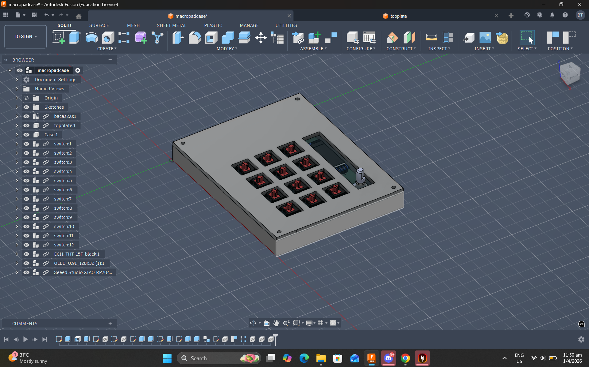
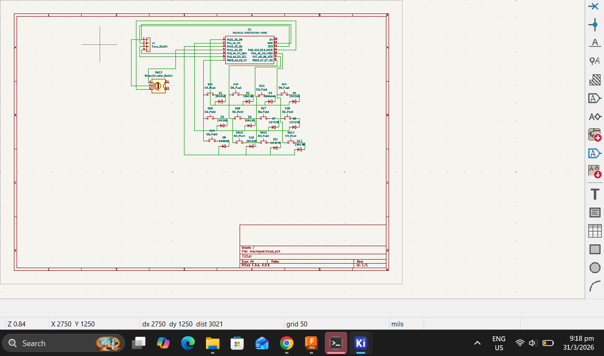
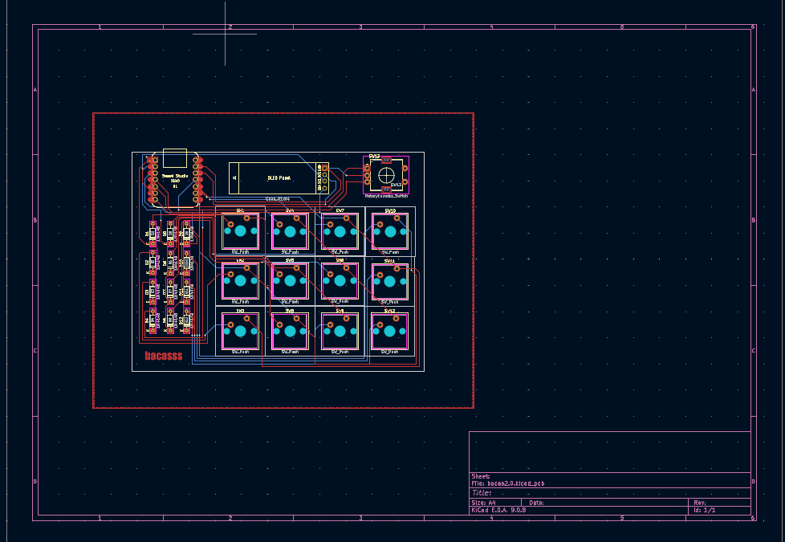
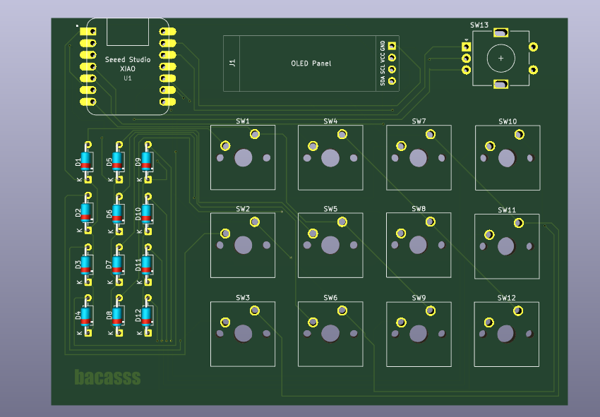
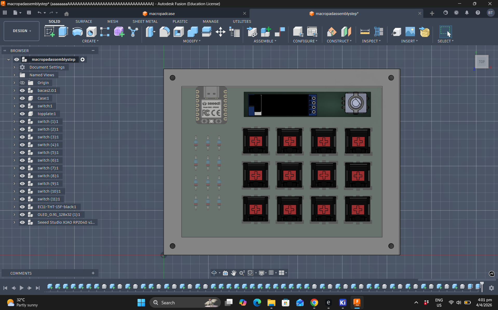

this is a 3x4 macropad, utilising 12 keys wired via matrix wiring with a rotary encoder and an oled display. the main microcontroller is a seeed studio xiao rp2040.

this is the first (well second time including the 1 x 3 example) creating a pcb and it was so fun learning, drawing and arranging the components and it took so long but i feel that its a vital skill that i'll definately need to touch on again

BOM:
1 Seeed XIAO RP2040
12x 1N4148 Diodes
12x MX-Style switches
1x EC11 Rotary encoders
1x 0.91 inch OLED display
12x white blank DSA keycaps
4x M3x16mm screws
4x M3x5mx4mm heatset inserts

Full mockup:

this is a full mockup of the entire design, including switches, the rotary encoder, the microcontroller, and the oled display

Schematic:

i ONLY found out there was a much neater way for my pcb schematic AFTER i finished it so apologies for the mess, but it was a new experience learning matrix wiring for efficient pin usage

PCB:

i tried to make the pcb as nice as possible, but this took so long haha
here it is in 3D:

final update, heres an image of the assembly with a translucent top plate:

